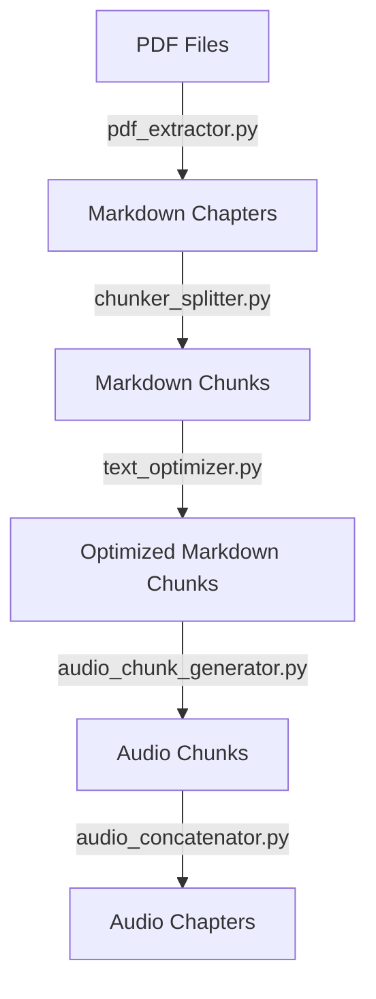

# Lidské Jednání Project / Projekt Lidské Jednání

## Overview / Přehled

Tento projekt zpracovává český překlad knihy "Human Action" (Lidské Jednání) z formátu PDF do optimalizovaných zvukových souborů prostřednictvím série kroků zpracování. Kódová základna obsahuje několik modulů, které zpracovávají různé aspekty zpracovatelského řetězce.

This project processes the Czech translation of the book "Human Action" (Lidské Jednání) from PDF format into optimized audio files through a series of processing steps. The codebase includes several modules that handle different aspects of the processing pipeline.

## STAV
- Textová data připravena: [4-markdown-chunks-optimized](./data/4-markdown-chunks-optimized)
- TODO: dokončit generování všech kapitol
  - `python audio_chunk_generator.py data/4-markdown-chunks-optimized/chapter_XX-OPTIMIZED.md`
- Regularly publishing to [youtube](https://youtube.com/playlist?list=PLaWOvDBjg6WiUcQm-yEP1RskMfPeWMKTL)

## Setup / Nastavení

### Requirements / Požadavky

- Python 3.8+
- ffmpeg (for audio manipulation)
- API keys for:
  - Anthropic Claude API (text optimization)
  - ElevenLabs API (text-to-speech)

### Installation / Instalace

```bash
# Clone the repository / Klonování repozitáře
git clone https://github.com/sparesparrow/human-action.git
cd human-action

# Create and activate virtual environment / Vytvoření a aktivace virtuálního prostředí
python3 -m venv .venv
source .venv/bin/activate  # On Windows: .venv\Scripts\activate

# Install dependencies / Instalace závislostí
pip install -r requirements.txt
```

### Environment Setup / Nastavení prostředí

Create a `.env` file in the root directory with your API keys:

```
ANTHROPIC_API_KEY=your_anthropic_api_key
ELEVENLABS_API_KEY=your_elevenlabs_api_key
```

## Processing Pipeline / Postup zpracování



## Directory Structure / Adresářová struktura

- [1-pdf](./data/1-pdf): Source PDF files / Zdrojové PDF soubory
- [2-markdown-chapters](./data/2-markdown-chapters): Extracted markdown chapters / Extrahované markdown kapitoly
- [3-markdown-chunks](./data/3-markdown-chunks): Split markdown files / Rozdělené markdown soubory
- [4-markdown-chunks-optimized](./data/4-markdown-chunks-optimized): Optimized markdown segments / Optimalizované markdown segmenty
- [5-audio-chunks](./data/5-audio-chunks): Audio files generated for individual optimized segments / Zvukové soubory vygenerované pro jednotlivé optimalizované segmenty
- [6-audio-chapters](./data/6-audio-chapters): Concatenated audio files into complete chapters / Spojené zvukové soubory do ucelených kapitol

## Modules / Moduly

### 1. PDF Extractor (`pdf_extractor.py`)
Extracts text from PDF files and creates markdown chapter files.
- **Input:** PDF file(s) from `data/1-pdf`
- **Output:** Markdown chapter files in `data/2-markdown-chapters`

### 2. Chunker Splitter (`chunker_splitter.py`)
Splits markdown chapter files into smaller segments for easier processing.
- **Input:** Markdown chapter files from `data/2-markdown-chapters`
- **Output:** Markdown chunks in `data/3-markdown-chunks`
- **Chunk size:** Maximum 5,000 characters per segment

### 3. Text Optimizer (`text_optimizer.py`)
Optimizes markdown chunks for speech synthesis using the Anthropic API.
- **Input:** Markdown chunks from `data/3-markdown-chunks`
- **Output:** Optimized markdown chunks in `data/4-markdown-chunks-optimized`
- **Optimization:** Removes references, footnotes, page numbers; joins hyphenated words at line breaks; fixes formatting

### 4. Audio Chunk Generator (`audio_chunk_generator.py`)
Converts text files to audio using the ElevenLabs API.
- **Input:** Optimized markdown files from `data/4-markdown-chunks-optimized`
- **Output:** Audio files in `data/5-audio-chunks`
- **Postprocessing:** After processing, input files are marked with the prefix "AUDIO_GENERATED-" to indicate they have been converted to audio

### 5. Audio Concatenator (`audio_concatenator.py`)
Concatenates multiple audio chunks into complete chapter audio files.
- **Input:** Audio chunks from `data/5-audio-chunks`
- **Output:** Complete chapter audio files in `data/6-audio-chapters`

## Text-to-Speech Formatting / Formátování textu pro syntézu řeči

For better control over speech synthesis in ElevenLabs, you can use these special formatting tags:

### Pauses / Pauzy

```
<break time="1s" />     <!-- 1 second pause -->
<break time="500ms" />  <!-- 500 millisecond pause -->
```

### Voice Adjustments / Úpravy hlasu

```
<prosody rate="slow" pitch="+20%">Text with higher pitch and slower rate</prosody>
<emphasis level="strong">Strongly emphasized text</emphasis>
```

### Greek Letters and Variables / Řecká písmena a proměnné

For Greek letters and variables, use plain text pronunciation:

```
"alfa účinku" instead of "α účinku"
"pé jedna větší než pé" instead of "p₁ > p"
```

## FFmpeg Commands for Audio Manipulation / FFmpeg příkazy pro manipulaci s audio

The `audio_concatenator.py` module uses ffmpeg for audio concatenation. Here are some useful ffmpeg commands:

### Concatenating Multiple Audio Files

```bash
# Using a file list
ffmpeg -f concat -safe 0 -i files.txt -c copy output.mp3
```

### Audio Manipulation

```bash
# Trim audio
ffmpeg -i input.mp3 -ss 00:00:10 -to 00:01:00 -c copy output.mp3

# Normalize volume
ffmpeg -i input.mp3 -filter:a loudnorm output.mp3

# Add silence
ffmpeg -i input.mp3 -af "apad=pad_dur=2" output.mp3
```

