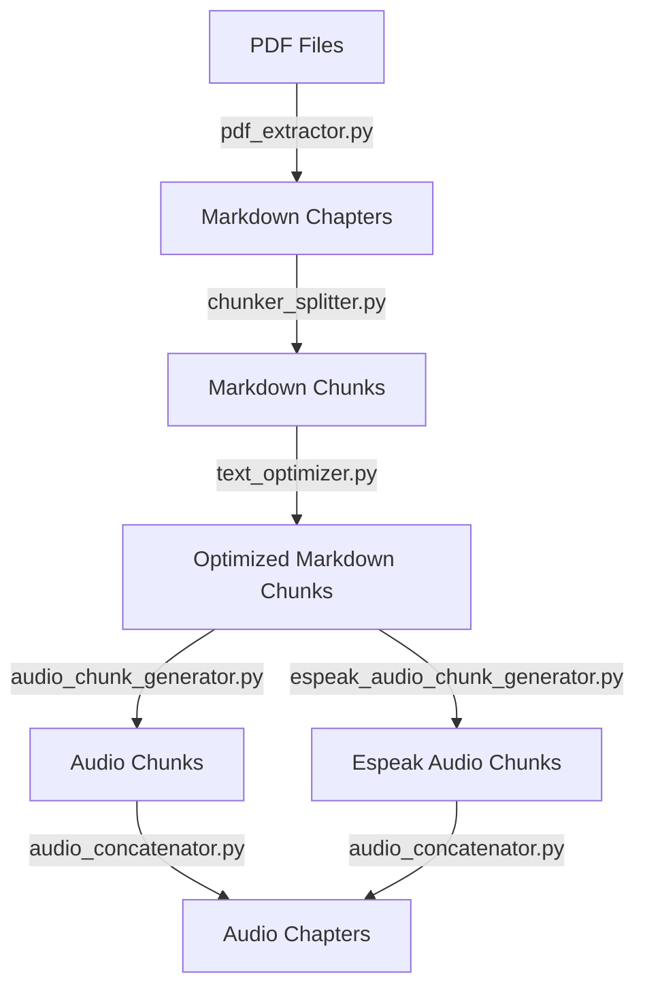
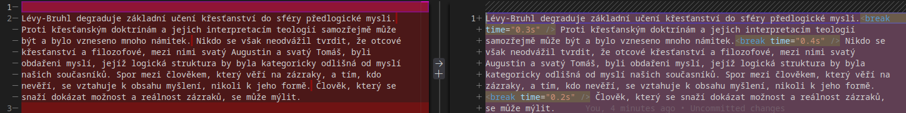
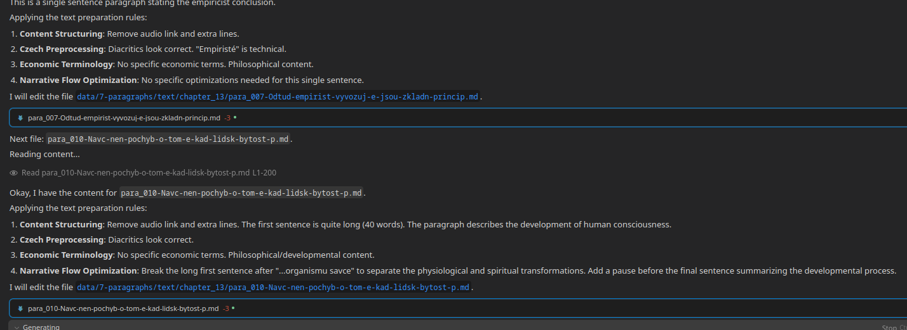

# Lidské Jednání Project / Projekt Lidské Jednání

## Overview / Přehled

Tento projekt zpracovává český překlad knihy "Human Action" (Lidské Jednání) z formátu PDF do optimalizovaných zvukových souborů prostřednictvím série kroků zpracování. Kódová základna obsahuje několik modulů, které zpracovávají různé aspekty zpracovatelského řetězce.

This project processes the Czech translation of the book "Human Action" (Lidské Jednání) from PDF format into optimized audio files through a series of processing steps. The codebase includes several modules that handle different aspects of the processing pipeline.

## STAV - DOKONČENO! ✅
- Textová data připravena: [4-markdown-chunks-optimized](./data/4-markdown-chunks-optimized)
- Audio generování dokončeno: [5-audio-chunks](./data/5-audio-chunks) + [6-audio-chapters](./data/6-audio-chapters)
- Voice quality optimization: 580 variantů testováno, vybrána nejlepší kvalita
- Finální formát: **WAV (44.1kHz, lossless)** - zachována maximální kvalita
- Celkem: 144 kapitol, 25+ hodin audioknihy
- Publikováno na [YouTube](https://youtube.com/playlist?list=PLaWOvDBjg6WiUcQm-yEP1RskMfPeWMKTL)

## Kvalita Audioknihy
- **Hlasový engine**: Piper TTS (cs_CZ-jirka-medium)
- **Kvalitní nastavení**: 'clear' preset pro akademický obsah
- **Formát**: WAV (44.1kHz, bezztrátový) - zachována 100% kvalita
- **Délka**: 25+ hodin profesionálního českého narration

## Automatizace celé pipeline (od PDF k publikaci audioknihy) na jedno tlačítko
- tohle je cíl, ale protože většina kroků pipeline už proběhla neautomatizovaně, bude to předmětem optimalizace kódu před zpracováním následujícího titulu

## Setup / Nastavení

### Requirements / Požadavky

- Python 3.8+
- ffmpeg (for audio manipulation)
- espeak-ng (for open-source TTS alternative)
- API keys for:
  - Anthropic Claude API (text optimization)
  - ElevenLabs API (text-to-speech)

### Installation / Instalace

```bash
# Clone the repository / Klonování repozitáře
git clone https://github.com/sparesparrow/human-action.git
cd human-action

# Create and activate virtual environment / Vytvoření a aktivace virtuálního prostředí
python3 -m venv .venv
source .venv/bin/activate  # On Windows: .venv\Scripts\activate

# Install dependencies / Instalace závislostí
pip install -r requirements.txt

# Install system dependencies (Ubuntu/Debian)
sudo apt-get install ffmpeg espeak-ng

# Or on macOS
brew install ffmpeg espeak-ng
```

### Environment Setup / Nastavení prostředí

Create a `.env` file in the root directory with your API keys:

```
ANTHROPIC_API_KEY=your_anthropic_api_key
ELEVENLABS_API_KEY=your_elevenlabs_api_key
```

## Processing Pipeline / Postup zpracování


```mermaid
graph TD
    A[PDF Files] -->|pdf_extractor.py| B[Markdown Chapters]
    B -->|chunker_splitter.py| C[Markdown Chunks]
    C -->|text_optimizer.py| D[Optimized Markdown Chunks]
    D -->|audio_chunk_generator.py| E[Audio Chunks]
    D -->|espeak_audio_chunk_generator.py| E2[Espeak Audio Chunks]
    E -->|audio_concatenator.py| F[Audio Chapters]
    E2 -->|audio_concatenator.py| F
```

## Directory Structure / Adresářová struktura

- [1-pdf](./data/1-pdf): Source PDF files / Zdrojové PDF soubory
- [2-markdown-chapters](./data/2-markdown-chapters): Extracted markdown chapters / Extrahované markdown kapitoly
- [3-markdown-chunks](./data/3-markdown-chunks): Split markdown files / Rozdělené markdown soubory
- [4-markdown-chunks-optimized](./data/4-markdown-chunks-optimized): Optimized markdown segments / Optimalizované markdown segmenty
- [5-audio-chunks](./data/5-audio-chunks): Audio files generated using ElevenLabs / Zvukové soubory vygenerované pomocí ElevenLabs
- [5-audio-chunks-espeak](./data/5-audio-chunks-espeak): Audio files generated using espeak-ng / Zvukové soubory vygenerované pomocí espeak-ng
- [6-audio-chapters](./data/6-audio-chapters): Concatenated audio files into complete chapters / Spojené zvukové soubory do ucelených kapitol
- [transcriptions/output](./data/transcriptions/output): YouTube video transcriptions / Transkripce YouTube videí
- [transcriptions/temp](./data/transcriptions/temp): Temporary transcription files (excluded from git) / Dočasné soubory transkripce (vyloučené z git)

## Modules / Moduly

### 1. PDF Extractor (`pdf_extractor.py`)
Extracts text from PDF files and creates markdown chapter files.
- **Input:** PDF file(s) from `data/1-pdf`
- **Output:** Markdown chapter files in `data/2-markdown-chapters`

### 2. Chunker Splitter (`chunker_splitter.py`)
Splits markdown chapter files into smaller segments for easier processing.
- **Input:** Markdown chapter files from `data/2-markdown-chapters`
- **Output:** Markdown chunks in `data/3-markdown-chunks`
- **Chunk size:** Maximum 5,000 characters per segment

### 3. Text Optimizer (`text_optimizer.py`)
Optimizes markdown chunks for speech synthesis using the Anthropic API.
- **Input:** Markdown chunks from `data/3-markdown-chunks`
- **Output:** Optimized markdown chunks in `data/4-markdown-chunks-optimized`
- **Optimization:** Removes references, footnotes, page numbers; joins hyphenated words at line breaks; fixes formatting

### 4a. Audio Chunk Generator (`audio_chunk_generator.py`)
Converts text files to audio using the ElevenLabs API.
- **Input:** Optimized markdown files from `data/4-markdown-chunks-optimized`
- **Output:** Audio files in `data/5-audio-chunks`
- **Postprocessing:** After processing, input files are marked with the prefix "AUDIO_GENERATED-" to indicate they have been converted to audio

### 4b. Espeak Audio Chunk Generator (`espeak_audio_chunk_generator.py`)
Alternative converter using the open-source espeak-ng TTS engine.
- **Input:** Optimized markdown files from `data/4-markdown-chunks-optimized`
- **Output:** Audio files in `data/5-audio-chunks-espeak`
- **Features:** Free and open-source, works offline, supports Czech language
- **Note:** Lower audio quality than ElevenLabs but useful for prototyping and development

### 5. Audio Concatenator (`audio_concatenator.py`)
Concatenates multiple audio chunks into complete chapter audio files.
- **Input:** Audio chunks from `data/5-audio-chunks` or `data/5-audio-chunks-espeak`
- **Output:** Complete chapter audio files in `data/6-audio-chapters`

### 6. YouTube Transcription Module (`transcribe/`)
Provides YouTube video transcription capabilities using OpenAI Whisper and yt-dlp.
- **Input:** YouTube URLs or direct video file URLs
- **Output:** Transcriptions in multiple formats (TXT, SRT, JSON, VTT) in `data/transcriptions/output`
- **Features:** Automatic audio extraction, Whisper transcription, optional translation to Czech, optional Czech TTS generation, optional video recombination
- **CLI:** `python scripts/transcribe_youtube.py "YOUTUBE_URL"`

## Free TTS/STT Engines / Volně dostupné TTS/STT nástroje

This project supports multiple free, open-source TTS (Text-to-Speech) and STT (Speech-to-Text) engines. The system automatically detects and prioritizes available engines.

### TTS Engines (Text-to-Speech) / TTS nástroje

| Engine | Quality | Speed | Offline | Czech Support | Installation |
|--------|---------|-------|---------|---------------|--------------|
| **Piper** | ⭐⭐⭐⭐⭐ | ⭐⭐⭐⭐⭐ | ✅ | ✅ Excellent | Download binary |
| **Coqui TTS** | ⭐⭐⭐⭐⭐ | ⭐⭐⭐ | ✅ | ✅ Excellent | `pip install TTS` |
| **eSpeak-ng** | ⭐⭐ | ⭐⭐⭐⭐⭐ | ✅ | ✅ Good | `sudo apt install espeak-ng` |
| **ElevenLabs** | ⭐⭐⭐⭐⭐ | ⭐⭐⭐⭐ | ❌ | ✅ Excellent | Paid API |

**Priority Order:** Piper → Coqui TTS → eSpeak-ng → ElevenLabs → Mock

#### Piper TTS Installation / Instalace Piper TTS

Piper is the recommended TTS engine - fast, local, and excellent Czech support.

```bash
# Download Piper binary for your platform
# Linux AMD64: https://github.com/rhasspy/piper/releases/download/v1.2.0/piper_amd64.tar.gz
wget https://github.com/rhasspy/piper/releases/download/v1.2.0/piper_amd64.tar.gz
tar -xzf piper_amd64.tar.gz
sudo mv piper/piper /usr/local/bin/
sudo mv piper/* /usr/local/share/piper/
rm -rf piper*

# Download Czech voice model
mkdir -p ~/.piper/models
cd ~/.piper/models
wget https://huggingface.co/rhasspy/piper-voices/resolve/v1.0.0/cs/cs_CZ-jirka-medium/cs_CZ-jirka-medium.onnx
wget https://huggingface.co/rhasspy/piper-voices/resolve/v1.0.0/cs/cs_CZ-jirka-medium/cs_CZ-jirka-medium.onnx.json
```

#### Coqui TTS Installation / Instalace Coqui TTS

```bash
pip install TTS
# Models are downloaded automatically on first use
```

#### eSpeak-ng Installation / Instalace eSpeak-ng

```bash
sudo apt update
sudo apt install espeak-ng
```

### STT Engines (Speech-to-Text) / STT nástroje

| Engine | Accuracy | Speed | Offline | Czech Support | Installation |
|--------|----------|-------|---------|---------------|--------------|
| **OpenAI Whisper** | ⭐⭐⭐⭐⭐ | ⭐⭐ | ❌ | ✅ Excellent | `pip install openai-whisper` |
| **Vosk** | ⭐⭐⭐⭐ | ⭐⭐⭐⭐⭐ | ✅ | ✅ Good | `pip install vosk` |
| **SpeechRecognition** | ⭐⭐⭐ | ⭐⭐⭐ | ❌ | ✅ Variable | `pip install SpeechRecognition` |

#### OpenAI Whisper Installation / Instalace OpenAI Whisper

```bash
pip install openai-whisper

# Models are downloaded automatically on first use
# Available models: tiny, base, small, medium, large
# tiny/base recommended for most use cases
```

#### Vosk Installation / Instalace Vosk

```bash
pip install vosk

# Download Czech model (~50MB)
wget https://alphacephei.com/vosk/models/vosk-model-small-cs-0.4.zip
unzip vosk-model-small-cs-0.4.zip
mv vosk-model-small-cs-0.4 ~/.vosk/cs
```

### Engine Configuration / Konfigurace nástrojů

Configure engines in `config.yaml`:

```yaml
tts:
  engine_priority: [piper, coqui, espeak-ng, elevenlabs, mock]

stt:
  engine: whisper  # whisper, vosk, speech_recognition
  whisper:
    model: base
    device: cpu
```

### Automatic Engine Detection / Automatická detekce nástrojů

The system automatically detects available engines:

```bash
python main.py --stage audio-gen
# Output:
# ✓ Using Piper TTS (fast, local, high quality)
# or
# ✓ Using Coqui TTS (high quality, multilingual)
# or
# ✓ Using eSpeak-ng TTS (system binary)
```

### Usage Examples / Příklady použití

#### TTS Generation / Generování TTS

```bash
# Automatic engine selection
python main.py --stage audio-gen

# Force specific engine (if available)
# Edit config.yaml: tts.engine_priority: [coqui]
python main.py --stage audio-gen
```

#### STT Transcription / Transkripce STT

```bash
# Using Whisper (default)
python scripts/transcribe_youtube.py "https://youtube.com/watch?v=VIDEO_ID"

# Using Vosk (if configured)
# Edit config.yaml: stt.engine: vosk
python scripts/transcribe_youtube.py "https://youtube.com/watch?v=VIDEO_ID"
```

### Troubleshooting / Řešení problémů

**Piper Issues / Problémy s Piper:**
- Ensure binary is in PATH: `which piper`
- Check model files exist: `ls ~/.piper/models/`
- Czech voices: Use `cs_CZ-jirka-medium` for high quality

**Coqui TTS Issues / Problémy s Coqui TTS:**
- First run may download large models
- Use smaller models for testing: `tts_models/en/ljspeech/tacotron2-DDC_ph`

**Whisper Issues / Problémy s Whisper:**
- Use smaller models on limited RAM: `tiny` or `base`
- CUDA acceleration: Set `device: cuda` in config (if GPU available)

**Vosk Issues / Problémy s Vosk:**
- Model must be downloaded manually
- Czech model path: `~/.vosk/cs`

## Testing / Testování

The project includes a comprehensive test suite to validate the functionality of all pipeline components.

### Running Tests

You can run tests using the provided script:

```bash
# Run all tests
./run_tests.py

# Run only unit tests
./run_tests.py --unit

# Run only integration tests
./run_tests.py --integration

# Run with verbose output
./run_tests.py -v
```

Or directly using pytest:

```bash
# Install pytest if not already installed
pip install pytest

# Run all tests
pytest tests/

# Run a specific test file
pytest tests/unit/test_pdf_extractor.py
```

### Test Structure

- **Unit Tests:** Individual component tests in `tests/unit/`
- **Integration Tests:** End-to-end pipeline tests in `tests/integration/`
- **Test Fixtures:** Sample data for testing in `tests/fixtures/`

### Cost-Saving Measures

The tests avoid using APIs that incur costs:
- Uses `espeak` instead of ElevenLabs for audio synthesis
- Skips testing the text optimization that would use Anthropic API

See `tests/README.md` for more details on the testing strategy.

## Batch Processing / Hromadné zpracování

To process all remaining files using espeak-ng, run:

```bash
./generate_espeak_audio.sh
```

This will:
1. Process all remaining markdown files that haven't been converted to audio yet
2. Save the generated audio files to `data/5-audio-chunks-espeak`
3. Track progress in `espeak_progress.json`
4. Log detailed information to `espeak_generation.log`

You can customize the processing with these parameters:

```bash
# Process with different voice and rate
./generate_espeak_audio.sh -v cs -r 160 -p 55

# Process only a limited number of files
./generate_espeak_audio.sh --max-files 5

# See all available options
./generate_espeak_audio.sh --help
```

## Text-to-Speech Formatting / Formátování textu pro syntézu řeči

For better control over speech synthesis in ElevenLabs, you can use these special formatting tags:

### Pauses / Pauzy
```markdown
<break time="1s" />     <!-- 1 second pause -->
<break time="500ms" />  <!-- 500 millisecond pause -->
```


### Voice Adjustments / Úpravy hlasu

```
<prosody rate="slow" pitch="+20%">Text with higher pitch and slower rate</prosody>
<emphasis level="strong">Strongly emphasized text</emphasis>
```

### Greek Letters and Variables / Řecká písmena a proměnné

For Greek letters and variables, use plain text pronunciation:

```
"alfa účinku" instead of "α účinku"
"pé jedna větší než pé" instead of "p₁ > p"
```

## Using LLMs for enhancing voice synthesis generated by Elevenlabs
- Use and improve [Cursor rules]:
  - [content-structuring](.cursor/rules/elevenlabs-content-structuring.mdc)
  - [czech-preprocessing](.cursor/rules/elevenlabs-czech-preprocessing.mdc)
  - [economic-terminology](.cursor/rules/elevenlabs-economic-terminology.mdc)
  - [narrative-flow-optimization](.cursor/rules/elevenlabs-narrative-flow-optimization.mdc)


## FFmpeg Commands for Audio Manipulation / FFmpeg příkazy pro manipulaci s audio

The `audio_concatenator.py` module uses ffmpeg for audio concatenation. Here are some useful ffmpeg commands:

### Concatenating Multiple Audio Files

```bash
# Using a file list
ffmpeg -f concat -safe 0 -i files.txt -c copy output.mp3
```

### Audio Manipulation

```bash
# Trim audio
ffmpeg -i input.mp3 -ss 00:00:10 -to 00:01:00 -c copy output.mp3

# Normalize volume
ffmpeg -i input.mp3 -filter:a loudnorm output.mp3

# Add silence
ffmpeg -i input.mp3 -af "apad=pad_dur=2" output.mp3
```

## Docker Support

This project can be run as a Docker container, which provides all the necessary dependencies pre-installed.

### Building the Docker Image

```bash
# Build the image
docker build -t human-action .

# Run the container with help output
docker run --rm human-action pipeline --help
```

### Using Docker Compose

A docker-compose.yml file is provided for easier management:

```bash
# Start the container
docker-compose up -d

# Run a command
docker-compose exec human-action pipeline --help

# Process a PDF file
docker-compose exec human-action pipeline process data/1-pdf/your-file.pdf
```

### Local Container Testing

You can test the container locally with the provided script:

```bash
# Make the script executable
chmod +x scripts/test-container.sh

# Run the test
./scripts/test-container.sh
```

## CI/CD with GitHub Actions

This project uses GitHub Actions for continuous integration and delivery:

1. **Run Tests**: Runs the test suite on every push and pull request
2. **Docker Build and Push**: Builds, tests, and publishes the Docker image to GitHub Container Registry
3. **Security Scan**: Checks the Docker image for vulnerabilities using Trivy

### Available Workflows

- `.github/workflows/test.yml`: Runs the unit and integration tests
- `.github/workflows/docker-build.yml`: Builds and pushes the Docker image
- `.github/workflows/security-scan.yml`: Scans the Docker image for vulnerabilities

### Using the Published Image

Once the workflows have run, you can use the published image from GitHub Container Registry:

```bash
# Pull the image
docker pull ghcr.io/YOUR_USERNAME/human-action:latest

# Run the container
docker run --rm ghcr.io/YOUR_USERNAME/human-action:latest pipeline --help
```

